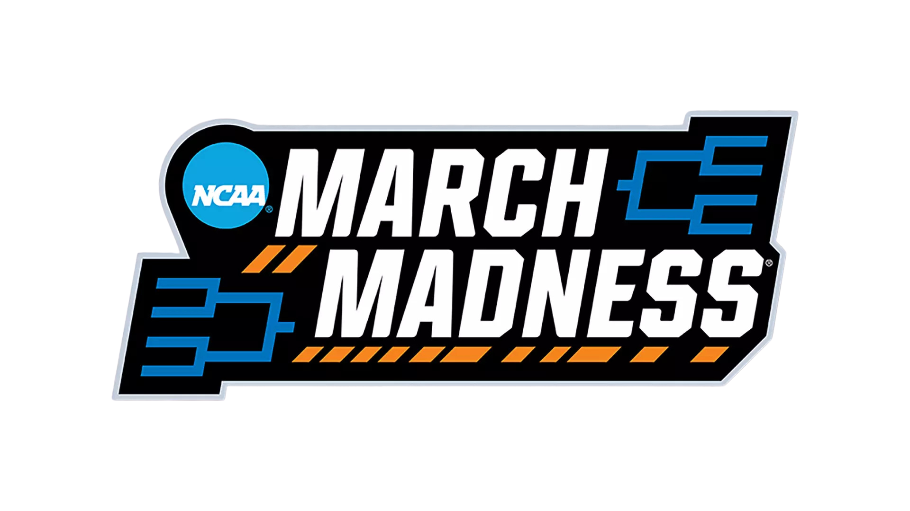
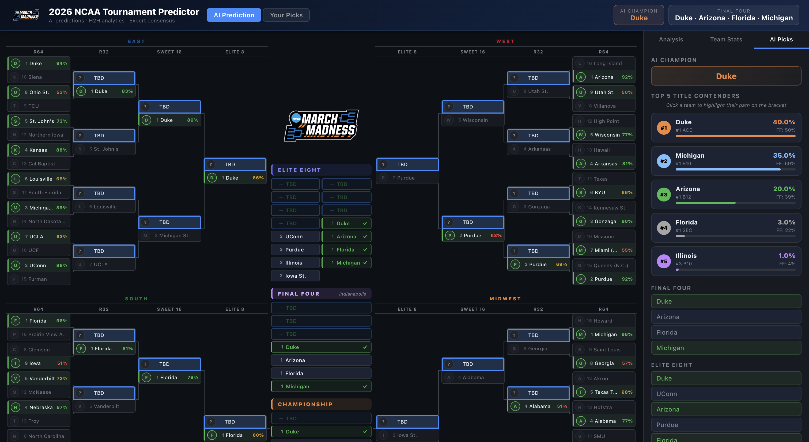
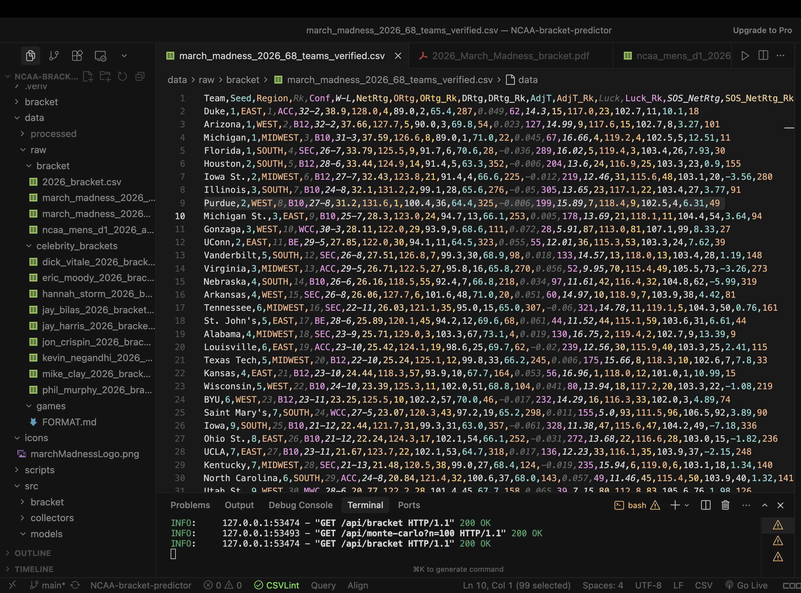
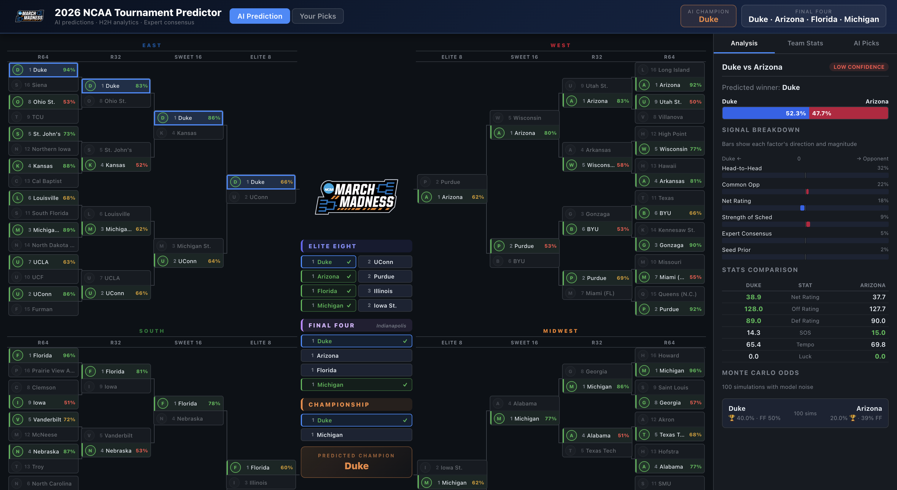

<p align="center">
  
</p>

# NCAA Bracket Predictor 2026

AI-powered 2026 NCAA Men's Basketball Tournament bracket predictor — full prediction engine backed by real season game data, advanced efficiency stats, and 9 ESPN/media expert brackets, with an interactive web app.

<p align="center">
  
</p>
<p align="center">
  
</p>
<p align="center">
  
</p>

---

## How the Predictions Work

Every game prediction combines 12 layers of evidence. The model converts each signal to a probability in logit space, weights them, then produces a final win probability via sigmoid.

### Signal Layers (in priority order)

| Weight | Signal | How it's used |
|---|---|---|
| **32%** | Head-to-head results | Did A beat B this season? Win/margin at neutral-adjusted site. If yes, this dominates. |
| **20%** | Common opponents | Both teams played team C — compare their neutral-adjusted margins, weighted by opponent strength (OpponentSRS). |
| **15%** | Net efficiency rating | Season-long points scored minus allowed per 100 possessions, adjusted for opponents. |
| **7%** | Strength of schedule | Average quality of every opponent faced. Prevents inflated mid-major stats. |
| **5%** | Celebrity consensus | 9 ESPN/media experts — per-matchup vote + agreement ratio. |
| **4%** | Non-conference SOS | Quality of opponents outside the conference — strongest cross-regional quality signal for tournament comparisons. |
| **4%** | Offensive rating | Points scored per 100 possessions. |
| **4%** | Defensive rating | Points allowed per 100 possessions (lower = better). |
| **3%** | Luck | How much the W-L record exceeds efficiency prediction. Lucky teams are penalized (regression to mean). |
| **3%** | Win percentage | Winning rate independent of efficiency — tournament-tested teams. |
| **1%** | Tempo | Pace mismatch adjustment. |
| **2%** | Seed prior | 40 years of empirical seed-matchup win rates (1985–2024). Weakest signal — only matters when everything else is even. |

### Key Stats Explained

| Stat | What it measures | Range (2026 field) |
|---|---|---|
| **NetRtg** | Points scored minus allowed per 100 possessions | Duke 38.9 (best) → Prairie View -10.7 (lowest) |
| **ORtg** | Offensive efficiency per 100 possessions | Purdue 131.6 (highest) |
| **DRtg** | Defensive efficiency per 100 possessions (lower = better) | Duke 89.0 (best defense) |
| **AdjT** | Possessions per 40 minutes (tempo) | Alabama 73.1 (fastest) → Saint Mary's 65.2 (slowest) |
| **SOS_NetRtg** | Average opponent quality across all games | Alabama 16.75 (hardest) → High Point -9.23 (easiest) |
| **NCSOS_NetRtg** | Non-conference schedule strength | Separates real quality from conference-bubble teams |
| **Luck** | How much W-L record exceeds efficiency prediction | High luck = regression risk in March |

### Neutral-Site Adjustment

Every game in the season logs is adjusted to a neutral-site equivalent before comparing margins:
- **Home game:** raw margin − 3.5 pts (remove home court advantage)
- **Away game:** raw margin + 3.5 pts (account for road disadvantage)
- **Neutral:** no adjustment

This means Duke beating Michigan by 5 at a neutral site is worth more than beating them by 9 at home.

### Monte Carlo Simulation

To estimate championship odds, the model runs 100 simulations with Gaussian noise (σ=0.7 logits) added to each game's logit score. This randomness models real-world variance — upsets, hot shooting nights, bracket luck. The champion odds reflect how often each team wins across all 100 simulated tournaments.

---

## Data Sources

| File | Contents | Rows |
|---|---|---|
| `data/raw/bracket/march_madness_2026_68_teams_verified.csv` | 68 tournament teams + full efficiency stats | 68 |
| `data/raw/bracket/march_madness_2026_parsed_game_logs.csv` | Every game played by all 68 teams this season | 2,103 |
| `data/raw/bracket/ncaa_mens_d1_2026_all_teams_stats.csv` | Full D1 stats (all teams, not just tournament) | 360+ |
| `data/raw/celebrity_brackets/*.csv` | 9 ESPN/media expert bracket picks | 9 files |

### Celebrity Experts Loaded
Dick Vitale · Jay Bilas · Hannah Storm · Eric Moody · Jay Harris · Jon Crispin · Kevin Negandhi · Mike Clay · Phil Murphy

---

## 2026 Predictions

### Monte Carlo Championship Odds (100 simulations)

| Rank | Team | Title % | Final Four % |
|---|---|---|---|
| 1 | **Duke** | **44%** | ~85% |
| 2 | **Michigan** | **25%** | ~60% |
| 3 | **Arizona** | **22%** | ~55% |
| 4 | **Florida** | **4%** | ~25% |
| 5 | **Houston** | **2%** | ~15% |

### Deterministic Prediction (most likely bracket)

| Round | Prediction | Key factor |
|---|---|---|
| **National Champion** | **Duke** | Beat Michigan 68–63 at neutral site (Feb 21) + best NetRtg in field (38.9) |
| **Final Four** | Duke, Arizona, Michigan, Florida | All top-5 NetRtg + strong H2H records |
| **Elite Eight** | Duke, Arizona, Florida, Michigan + 4 others | |

> Duke is the model's top pick despite experts slightly favoring Michigan, because Duke's direct H2H win carries 32% of the prediction weight — the strongest single signal in the model.

### Celebrity Champion Consensus
| Team | Expert picks |
|---|---|
| Michigan | 3 / 9 (Moody, Harris, Crispin) |
| Arizona | 3 / 9 (Storm, Bilas, Negandhi) |
| Florida | 2 / 9 (Vitale, Murphy) |
| Duke | 1 / 9 (Phil Murphy via different path) |

---

## Web App Features

The interactive bracket app has two modes:

### AI Picks Mode
- Full predicted bracket with game-by-game win probabilities and confidence ratings
- **Top 5 Title Contenders** panel — ranked by Monte Carlo championship odds with probability bars
- **Path Bracket** — click any top-5 team to see their full projected path to the title. The bracket updates to show that team winning their games; all other games fall back to AI predictions.
- Center column shows Elite Eight, Final Four, and predicted champion

### My Picks Mode
- Fill out your own bracket by clicking team names to advance them
- Monte Carlo championship odds shown per team as you pick
- Score tracker: how many of your picks match the AI model

---

## Project Structure

```
NCAA-bracket-predictor/
├── data/
│   ├── raw/
│   │   ├── bracket/
│   │   │   ├── march_madness_2026_68_teams_verified.csv
│   │   │   ├── march_madness_2026_parsed_game_logs.csv
│   │   │   └── ncaa_mens_d1_2026_all_teams_stats.csv
│   │   ├── celebrity_brackets/          ← 9 expert CSV bracket picks
│   │   └── games/                       ← optional: additional game CSVs
│   └── processed/                       ← generated outputs (gitignored)
│       ├── simulation_results.csv
│       ├── predicted_bracket.json
│       └── mc_odds.json                 ← Monte Carlo championship odds (cached)
├── src/
│   ├── collectors/
│   │   ├── bracket_collector.py         ← loads 68-team stats CSV
│   │   ├── season_results.py            ← H2H + common opponent engine
│   │   └── celebrity_brackets.py        ← loads + normalizes all expert picks
│   ├── models/
│   │   └── predictor.py                 ← 12-signal weighted logit prediction model
│   ├── bracket/
│   │   └── simulator.py                 ← simulates all 67 games
│   └── utils/
│       └── name_normalizer.py           ← maps name variants across data sources
├── scripts/
│   ├── 01_collect_bracket.py            ← validate bracket data
│   └── 02_simulate_bracket.py           ← run full simulation + print results
├── web/
│   ├── backend/
│   │   └── app.py                       ← FastAPI server (pre-computes MC at startup)
│   └── frontend/                        ← React + Vite bracket UI
│       └── src/
│           ├── components/
│           │   ├── Bracket.jsx          ← full interactive bracket + path mode
│           │   ├── Header.jsx           ← champion + Final Four banner
│           │   └── Sidebar.jsx          ← team stats + Top 5 Contenders
│           └── App.jsx
├── requirements.txt
└── start.sh
```

---

## Setup

```bash
# 1. Create virtual environment (ARM Python — required on Apple Silicon)
/opt/homebrew/bin/python3 -m venv .venv

# 2. Install Python dependencies
.venv/bin/pip install -r requirements.txt

# 3. Install frontend dependencies
cd web/frontend && npm install && cd ../..
```

## Running

```bash
# Development: API on :8000, React dev server on :5173
./start.sh

# Production: builds React, serves everything from FastAPI on :8000
./start.sh --prod
```

The backend pre-computes Monte Carlo odds at startup (or loads from disk cache if available). First startup after clearing the cache takes ~15 seconds; subsequent starts are instant.

### Run simulation manually
```bash
.venv/bin/python scripts/02_simulate_bracket.py
```
Outputs: `data/processed/simulation_results.csv` and `data/processed/predicted_bracket.json`

---

## API Endpoints

| Endpoint | Method | Description |
|---|---|---|
| `/api/bracket` | GET | Full bracket JSON — all 67 game predictions with factors |
| `/api/teams` | GET | All 68 teams with efficiency stats |
| `/api/celebrity` | GET | Expert bracket summary, champion votes, Final Four votes |
| `/api/monte-carlo` | GET | Championship/Final Four/Elite Eight odds from 100 simulations (cached) |
| `/api/monte-carlo?refresh=true` | GET | Force recompute Monte Carlo odds |
| `/api/simulate` | GET | Re-run simulation, refresh `predicted_bracket.json` |

---

## Adding More Data

### Additional game results
Drop CSV files in `data/raw/games/` using the schema in `data/raw/games/FORMAT.md`.
The more complete the data (including non-tournament teams), the stronger the common opponent chains.

### Additional celebrity/expert brackets
Drop CSV files in `data/raw/celebrity_brackets/` using this schema:
```csv
Region,Round,Matchup,Winner
East,Round of 64,Duke vs Siena,Duke
...
Championship,Championship,Duke vs Michigan,Duke
```
The file is auto-loaded on next simulation run.
